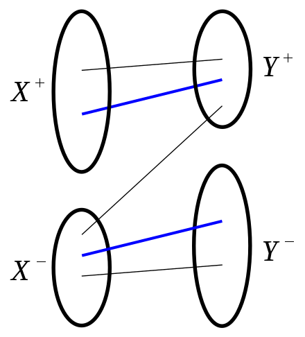

#### Statement

In any [bipartite graph](bipartite%20graph) the number of edges in a [maximum matching](maximum%20matching) equals the number  of vertices in a [minimum vertex cover](minimum%20vertex%20cover)

#### Constructive proof

Let’s construct a [minimum vertex cover](minimum%20vertex%20cover) from some [maximum matching](maximum%20matching) $M$. Let’s direct all the edges in the matching right to left, and other left to right. Now let’s traverse the graph starting from vertices in the left part that are not saturated. Let’s call visited vertices in left and right parts $X^+$ and $Y^+$ respectively. Analogically unvisited vertices are $X^-$ and $Y^-$.

Blue edges are from the matching and all other edges are black. Now there are no black edges from $X^+$ to $Y^-$ and analogically no blue edges from $Y^+$ to $X^-$ by construction.

Now let’s prove there are no blue edges from $X^+$ to $Y^-$ either. Let’s [prove by contradiction](prove%20by%20contradiction).  Let’s assume there is some blue edge ${x^+, y^-}$. Vertex $x^+$ can’t be the starting vertex of graph traversal, since it’s incident to an edge in $M$. So it’s predecessor is on the right and all the edges from right to left are blue. That means there is some blue edge ${x^+, y^+}$, which contradicts the fact that $M$ is a matching, because there are two blue edges connecting vertex $x^+$.

So every edge in the graph is incident to $C = X^- \cup Y^+$ and it’s a [vertex cover](vertex%20cover). Now let’s prove it’s minimal. Let’s prove every vertex in $C$ is saturated by $M$. $X^-$ is saturated by construction. Now if some vertex $y^+$ is not saturated by $M$, then there exists an augmenting path in $M$ and $M$ is not a maximal matching (refer to [Kuhn’s Algorithm](Kuhn%E2%80%99s%20Algorithm)). That means that $|C| = |X^- \cup Y^+| = |M|$ and $C$ is a [minimum vertex cover](minimum%20vertex%20cover)

#### Related
There are other proofs which include [Ford-Fulkerson Theorem](Ford-Fulkerson%20Theorem.md) and [linear programming](linear%20programming)  [duality](duality)